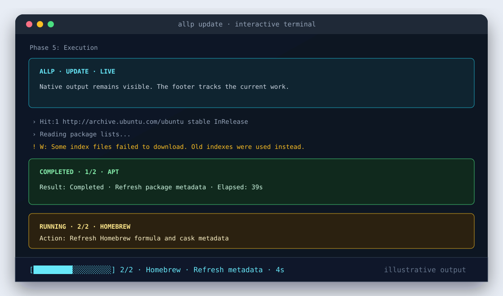

# Allp

[English](README.md) | [فارسی](README.fa.md)

> One CLI for the package managers already on your machine.

Allp is a transparent package-manager orchestrator with a cross-platform runtime core and Linux-first package backends. It discovers native tools such as APT, Pacman, DNF, Flatpak, Snap, Homebrew/Linuxbrew, Python installers, and Node installers, then shows the exact native command or local API request before anything mutates the system.

Current build version: **0.4.0.1** (Cargo base version **0.4.0**)
Maturity: **public alpha**

## Why Allp Exists

Linux software often lives across system repositories, universal app stores, Homebrew, Python, and Node. Allp gives those sources one consistent command surface without hiding the native package managers or pretending they are interchangeable.

Core principles:

- Native package managers remain visible and authoritative.
- Every mutating plan shows the exact native command.
- Commands are executed directly, not through hidden shell pipelines.
- Source selection is explicit when names collide.
- Backends advertise capabilities instead of generic code guessing behavior.
- Privilege handling is centralized and child-process only.

## Supported Systems

The platform layer detects Linux distributions and package-manager families, macOS, Windows, WSL, containers, architecture, libc, users, executable ownership, and platform data directories. Package orchestration is maturest on Linux. Homebrew/macOS remains experimental; Windows currently supports compilation, diagnostics, release-target selection, and deferred self-replacement, but does not advertise Linux-only Snap or Flatpak backends.

## Backends

| Source | Status | Search | Install | Remove | Update | Upgrade | List | Info |
|---|---:|---:|---:|---:|---:|---:|---:|---:|
| APT | Stable alpha | yes | yes | yes | yes | yes | yes | yes |
| Pacman | Stable alpha | yes | yes | yes | yes | yes | yes | yes |
| DNF / DNF5 | Stable alpha | yes | yes | yes | yes | yes | yes | yes |
| Flatpak | Stable alpha | yes | yes | yes | yes | yes | yes | yes |
| Snap | Stable alpha | yes | yes | yes | yes | yes | yes | yes |
| Zypper, APK, XBPS, Portage, eopkg, swupd | Experimental | yes | mixed | mixed | mixed | mixed | mixed | mixed |
| Homebrew / Linuxbrew | Experimental | yes | yes | yes | yes | yes | yes | yes |
| Python: PyPI with pip, pipx, uv | Experimental | yes | yes | yes | yes | yes | yes | yes |
| Node: npm registry with npm, pnpm, Yarn | Experimental | yes | yes | yes | yes | yes | yes | yes |

JSON is available for read-only commands and dry-run maintenance/install planning where supported. See [docs/CAPABILITY_MATRIX.md](docs/CAPABILITY_MATRIX.md) for the detailed matrix.

## Installation

Build from source:

```bash
git clone https://github.com/allp-manager/allp-manager.git
cd allp-manager
cargo build --release
./target/release/allp --version
```

Install the release binary globally:

```bash
make install
allp --version
allp update && allp upgrade
```

`allp --version` prints the display/build version; `allp --version --verbose` also prints the base version, build revision, channel, commit, build ID, target, timestamp, and whether CI marked the build official. `allp update` defaults to verified continuous main-branch builds so fixes can update `0.4.0.1` to `0.4.0.2` without changing Cargo SemVer. Use `--update-channel stable` to persist the tagged-release channel.

`make install` builds the release binary and installs it as
`/usr/local/bin/allp`. It uses `sudo install` for that one file copy. For a
user-local install without sudo:

```bash
make install-user
```

Requirements:

- Rust 1.74 or newer
- Cargo
- The native package managers you want Allp to detect
- `sudo` only when a root-required child command actually needs elevation

Release binary usage is simply:

```bash
allp detect
allp search git
```

## Quick Start

```bash
allp detect
allp search git
allp install git
allp install git --dry-run
allp install pycharm
allp update
allp upgrade
allp upgrade --allow-stale-metadata # explicit recovery only
allp update --scope dev
allp search git --json
```

`update` refreshes backend metadata; it does not upgrade Snap, Flatpak, or Homebrew packages. `upgrade` upgrades installed software. When APT needs a metadata refresh first, that refresh is a required dependency: a failure defers the APT upgrade. `--allow-stale-metadata` is an explicit override, never the default.

Homebrew discovery uses one validated locator across detect, doctor, and package operations. It checks configured/custom locations, PATH, revalidated state, deterministic original-user paths, and the official Linux/macOS prefixes, so `sudo` omitting Linuxbrew from root's PATH does not make an existing installation disappear. Homebrew metadata refresh prefers `brew update-if-needed`. Upgrade discovery and execution set `HOMEBREW_NO_AUTO_UPDATE=1`, use structured `brew outdated --json=v2` evidence, skip empty upgrades, and verify outdated state afterward. Homebrew probes and operations run in its validated owner's user context even when Allp was launched through sudo.

Before changing Homebrew on a host where Allp is invoked through `sudo`, verify
the shared locator and the original-user boundary first:

```bash
allp doctor homebrew --verbose --no-color
sudo allp doctor homebrew --verbose --no-color
sudo allp update --from homebrew --dry-run --skip-self-update --no-interactive --no-color -v
```

The dry run must identify the selected owner and Homebrew executable; its
preview is descriptive, while the real child retains the validated privilege
boundary and sanitized owner environment. After review, a real metadata refresh
can be requested explicitly:

```bash
sudo allp update --from homebrew --yes --skip-self-update
```

See [the Homebrew backend guide](docs/HOMEBREW_BACKEND.md) for validation
details and macOS/Linuxbrew limits.

## Live Maintenance Dashboard

On a real interactive `update` or `upgrade`, Allp 0.4.0 presents an inline live
dashboard during execution. Native logs remain in normal terminal scrollback;
status and error cards make important events stand out; and the footer shows
the active backend, exact action, elapsed time, and explicit queue completion.
It is not a full-screen terminal takeover, so Ctrl+C does not require raw-mode
restoration. When selected maintenance plans need administrator access, Allp
validates it with `sudo -v` before the dashboard starts, then runs those
children with `sudo -n --` so a password prompt never appears in the footer.



Use the classic output whenever you prefer it or are recording a familiar log:

```bash
allp update --no-tui
allp upgrade --no-tui
```

The dashboard is intentionally absent from JSON, dry runs, redirected/non-TTY
output, `TERM=dumb`, and `--no-interactive` runs. `--no-color` keeps the layout
but removes color. The dashboard only observes the process runner: it never
rewrites the planned native argv or plan-level privilege requirement; the
privilege boundary is fixed before rendering begins. Full behavior and fallback
rules are in
[docs/TERMINAL_UI.md](docs/TERMINAL_UI.md).

Use `--from` for a precise backend:

```bash
allp install git --from apt --dry-run
allp install pycharm --from snap --dry-run
allp install black --from pipx --dry-run
allp install typescript --from pnpm --dry-run
```

## Search And Selection

Without `--from` or `--scope`, interactive `search` and `install` ask for one of three scopes:

- `apps`: system packages, universal applications, and Homebrew
- `dev`: Python and Node ecosystems
- `all`: every eligible source

Results are ranked as `Exact`, `Related`, or `Fuzzy`. All exact matches are shown, related matches are capped per backend, and weak fuzzy matches require `--all`.

Large interactive result sets keep stable global numbers. Space moves forward, `b` moves back, `/` filters, a number selects directly, Enter selects the highlighted or first visible result, and `q` or Escape cancels.

## Privilege Behavior

Preferred:

```bash
allp update
```

Allp itself should normally run as your user. For a confirmed maintenance run,
Allp validates administrator access once with `sudo -v` before the live
dashboard starts, then runs root-required children with `sudo -n --`. This
keeps password prompts out of the dashboard. If a later cached credential
expires, Allp clears the footer, revalidates with `sudo -v` outside the
dashboard, and resumes only after success; an unsuccessful revalidation is a
blocked operation rather than a package-manager failure. Dry runs never invoke
sudo.

If you intentionally run:

```bash
sudo allp update
```

Allp does not add nested sudo. Root-required system plans run directly, and user-scoped plans such as Homebrew, Python, Node, and Flatpak-user run as the original sudo user when that identity is available.

`--yes` bypasses only Allp's final confirmation after choices are resolved. It
does not indiscriminately add native confirmation flags: APT upgrades receive
their documented `-y` flag, while APT metadata refreshes remain `apt-get update`
without `-y`.

## Snap Discovery And Resolution

Snap uses the local snapd REST API through `/run/snapd.socket` when it is reachable. Wide discovery and exact resolution are separate:

```text
GET /v2/find?q=<encoded-query>&scope=wide
GET /v2/find?name=<encoded-canonical-name>
```

A discovery row is never an installation plan. After selection, exact resolution verifies:

- canonical package name and display title;
- publisher and verification state;
- confinement;
- architecture availability;
- tracks and channels;
- stable-channel availability;
- installed state.

An authoritative snapd `404` with `kind: snap-not-found` means unavailable. It is not a transport error and never falls through to `snap info`. Allp stops before sudo or installation, and `Try another installer` performs a fresh search with Snap excluded and cached Snap results discarded.

CLI fallback is allowed only when the socket is absent or denied, connection fails, an endpoint is unsupported, or the response is not recognizable as snapd. The concrete fallback reason is kept in diagnostics. CLI exact resolution uses an argv vector equivalent to `snap info <name>`; successful exit status remains success even if stderr contains a warning.

REST installation sends `POST /v2/snaps/<name>`, includes `"classic": true` only for classic confinement, and polls `/v2/changes/<id>` until a terminal state. A change ID alone is not success. CLI fallback adds `--classic` only when metadata requires it:

```bash
allp install pycharm --from snap --dry-run
# when CLI fallback is active, the native plan includes:
snap install pycharm --classic
```

Strict snaps do not receive `--classic`. If no stable channel exists, or multiple stable tracks exist without a safe default, Allp stops instead of silently choosing candidate, beta, edge, or an arbitrary track.

## Flatpak And Prerequisites

Flatpak distinguishes four states: not installed, installed without remotes, installed with remotes, and backend error. Remote detection uses:

```bash
flatpak remotes --columns=name,title,url,filter,options
```

No remotes means no searchable catalog; it is not reported as "no package match." Allp can offer a separate, user-scoped Flathub plan using the exact remote name and URL. It never adds Flathub automatically. `--yes` alone cannot bootstrap an executable, enable a service, or add a remote; unattended approval requires both `--yes --allow-bootstrap`, after the full plan is printed.

Missing Flatpak or Snap executables can be planned through structured APT, DNF, Pacman, Zypper, or APK bootstrap providers where a mapping is known. After an approved install, Allp refreshes capability and backend detection and continues only if the requirement is verified. Flatpak results preserve application ID, branch, remote, version, name, and description, and installation uses the remote plus application ID.

## Python And Node

Python support treats PyPI as the source and pip, pipx, and uv as installer choices. Node support treats the npm registry as the source and npm, pnpm, and Yarn as installer choices. Registry matches are not treated as official merely because a name looks familiar, and fuzzy Python/Node matches are never installed automatically.

Examples:

```bash
allp search openai --from python
allp install black --from pipx --dry-run
allp search typescript --from node
allp install typescript --from pnpm --dry-run
allp update --scope dev --target all --dry-run
```

## Dry Run And JSON

Dry run performs discovery, search, selection, metadata validation, and execution-plan construction. It skips only mutating native command execution.

```bash
allp install git --dry-run
allp install pycharm --from snap --dry-run
allp update --dry-run
```

JSON examples:

```bash
allp detect --json
allp search git --json
allp list --json
allp info git --json
allp update --dry-run --json
```

Human logs are not mixed into JSON stdout.

## Update, Self-Update, And Doctor

`allp update` checks the trusted repository `allp-manager/allp-manager` before ordinary backend metadata updates unless disabled. Its phases cover self-update, platform/capability refresh, backend planning, confirmation, execution, and summary.

```bash
allp doctor
allp self-update --check-only
allp self-update --offline
allp update --check-only
allp update --skip-self-update
allp update --self-only
allp update --offline
allp update --update-channel prerelease
```

Continuous verified main-branch builds are the default channel; stable and prerelease selections are explicit and persisted. Stable release metadata must contain `allp-release-manifest.json`, while continuous builds use their dedicated manifest and trusted workflow identity. Allp compares base SemVer before build revision, selects an asset by OS, architecture, libc, executable format, and target, and reports unsupported targets without staging an update.

If the installed build is newer than the selected channel, Allp reports the
distinct `LocalAhead` state and does not downgrade it; this is not described as
up to date.

A binary installed with `make reinstall` is marked as a local development build, but it still follows a newer verified continuous build from `main` (including the local revision-1 collision). That means a merged GitHub change is detected by the default `allp update` channel once its successful continuous build is published; the normal replacement confirmation remains in place.

Downloads are HTTPS-only, bounded by redirects, time, and size, restricted to the exact official repository/tag/asset, and verified with SHA-256 before safe extraction. The staged binary must report the expected version. Linux and macOS replacement uses same-directory staging, a rollback backup, post-install verification, and minimal elevation for non-writable installations. Windows uses a verified deferred helper. A guarded relaunch continues `allp update` once without entering an update loop. Offline mode contacts neither GitHub nor backend remote sources.

`allp doctor` reports platform, users, install path ownership/writability, executable paths, backend states, Snap socket reachability, Flatpak remotes, trusted update source, release target, and cache/state/config paths without printing tokens or unrelated environment data.

## Makefile Workflow

The root Makefile keeps development, installation, and local release work in
plain commands:

```bash
make help
make fmt
make fmt-check
make check
make clippy
make test
make architecture
make build
make release
make quality
make run ARGS="search git"
make doctor
make version
make git-status
make docs-check
make install
make reinstall
make uninstall
make install-user
make install-check
```

`make install`, `make reinstall`, and `make uninstall` use sudo only to manage
`/usr/local/bin/allp`. They do not install native packages, run Allp package
operations, commit, push, tag, publish, or hide failures.

`make reinstall` now warns if your shell resolves `allp` from another location
(for example `~/.local/bin/allp`). Run `make install-check` after installing;
use `make install-user` deliberately when the user-local copy is the one you
want to refresh.

## Local Release Workflow

The release workflow is explicit. Local preparation never pushes, publishes a
GitHub Release, or uploads assets. A GitHub Release is created only after a
semantic-version tag such as `v0.4.0` is pushed.

Run once per clone:

```bash
make hooks-install
```

Prepare the next version explicitly:

```bash
make release-prepare BUMP=patch
# or:
make release-prepare VERSION=0.4.0
```

`release-prepare` updates the package version, Cargo.lock through Cargo,
CHANGELOG, README version references, a tracked release title such as
`release/RELEASE_TITLE_v0.4.0.txt`, and a tracked draft such as
`release/RELEASE_NOTES_v0.4.0.md`, then runs `make quality`. It writes an
ignored readiness marker only after that quality gate passes.

Commit the prepared files normally, for example from VS Code Source Control:

```text
release: Allp v0.4.0
```

Only a commit whose subject begins with `release:` and matches the prepared
marker is finalized. The post-commit hook creates:

- annotated local tag `v0.4.0`
- `dist/allp-v0.4.0-source.tar.gz`
- `dist/allp-v0.4.0-source.tar.gz.sha256`
- `dist/RELEASE_NOTES_v0.4.0.md`

The source archive is generated from the exact committed tag with `git archive`.
Ordinary commits such as `fix: improve Snap parsing` do not change versions,
create tags, or generate `dist/` output. Use `make release-status` to inspect
state and `make release-workflow-test` to run the temp-repository automation
tests. VS Code task examples live in `contrib/vscode/tasks.json` because
`.vscode/` is editor-local and ignored.

When the local release tag is ready, run `make release-push` explicitly. It
verifies the release commit, annotated tag, and tag target, then pushes the
current branch and matching tag. The tag-only GitHub Actions workflow creates
the GitHub Release from the prepared title and notes. It builds and tests
Linux x86_64/aarch64, macOS x86_64/aarch64, and Windows x86_64 binaries;
uploads their archives and checksums; creates the exact-tag source archive; and
generates and verifies `allp-release-manifest.json`. It refuses an existing
conflicting release.

## Troubleshooting

| Symptom | What to do |
|---|---|
| APT lock error | Wait for the owning package process. Do not delete dpkg lock files. |
| DNF/RPM database error | Check rpmdb permissions or repair the RPM database before retrying. |
| Missing pip, pipx, or uv | Run `allp detect --verbose` and install/configure the missing Python tool intentionally. |
| npm global permission issue | Fix npm prefix ownership or use a user-owned Node manager; Allp will not sudo npm globals. |
| Flatpak has no remotes | Run `allp doctor`; review and explicitly approve the offered Flathub user-remote plan if desired. |
| Snap exact result unavailable | Run `allp doctor` and Snap diagnostics. A valid REST `snap-not-found` is authoritative. |
| Snap CLI fallback | Diagnostics show why REST was unavailable and the exact CLI argv/output. |
| Self-update unavailable | Use `allp self-update --check-only -v`; unsupported targets leave the installed binary unchanged. |

## Security Model

Allp stores commands as program plus argument vector and never executes package-manager work through `sh -c`. Native package output is data, not trusted code. Dry runs do not execute installers. Bootstrap actions are separate plans. Self-update rejects foreign repositories, unsafe asset names, malformed manifests, checksum mismatches, archive traversal, and staged-version mismatches. State files contain no credentials. Allp does not store sudo passwords or collect telemetry; any operation-specific native confirmation flag is explicit in its reviewed plan.

Read [SECURITY.md](SECURITY.md) for reporting and alpha limitations.

## Architecture

```text
CLI -> platform/capabilities -> requirements -> discovery -> operation -> backend -> execution
                                      |             |             |
                                  bootstrap     alternatives   diagnostics
CLI -> self_update -> release manifest -> verified replacement -> guarded re-execution
```

Backends own native syntax, REST/CLI transport details, and parsers. Generic operations coordinate capabilities, selection, alternatives, confirmation, and immutable plans. Bootstrap providers are independent of the backend that needs them. The runner owns direct process execution, output streaming, sudo handling, and original-user de-escalation.

See [ARCHITECTURE.md](ARCHITECTURE.md), [docs/BACKEND_CONTRACT.md](docs/BACKEND_CONTRACT.md), and [docs/PRIVILEGE_MODEL.md](docs/PRIVILEGE_MODEL.md).

## Development

```bash
cargo fmt --all
cargo fmt --all -- --check
cargo check --all-targets
cargo test --all-targets
bash scripts/check-architecture.sh
cargo build --release
make quality
```

Use fake executable fixtures for package-manager behavior. Do not run destructive package-manager operations in tests.

cargo clippy --all-targets --all-features -- -D warnings
## Contributing

Keep backend-specific parsing and flags inside backend modules. Add fixtures for parser changes. Preserve command syntax, JSON contracts, privilege behavior, dry-run semantics, and terminal UI expectations. See [CONTRIBUTING.md](CONTRIBUTING.md).

## Roadmap

Near-term work is broader real-distro validation, richer parser fixtures, an
interactive Snap channel chooser, deeper signal/trusted-path testing, and
real-host Homebrew validation. Version 0.4.0 introduces the focused live
maintenance TUI; a broader full-screen TUI and GUI remain later work, alongside
future ecosystems such as Cargo, Composer, Go, RubyGems, and Maven/Gradle.

See [ROADMAP.md](ROADMAP.md) and [TODO.md](TODO.md).

## Changelog

Version `0.4.0` adds the inline live maintenance dashboard, the `--no-tui`
classic-stream fallback, stronger Homebrew original-user validation, and
self-update/reinstall recovery hardening. See [CHANGELOG.md](CHANGELOG.md).

## Known Limitations

- Allp is public alpha software and not security-audited.
- Snap multiple-track selection is conservative and may require native `snap` commands for explicit channel choice.
- Existing GitHub releases without a valid manifest and matching binary asset cannot self-update automatically.
- Experimental backends need broader validation on real distributions and host setups.
- Python and Node project-scope policies remain intentionally cautious.
- Signal forwarding and deeper trusted-path validation remain future hardening work.

## License

MIT. See [LICENSE](LICENSE).


### 💚 Donate

https://daramet.com/wrench
